<!-- Trungquandev -->

 
<h2 align="center">👽 Where to find me 👽</h2>
 
<!-- https://icons8.com -->

  
  
  
  
  

<!-- Animated Wave Section -->

  

    <ul class="waves">
      <li class="wave-one" style="background-image: url('https://i.postimg.cc/7LtCC11Y/wave1.png');"></li>
      <li class="wave-two" style="background-image: url('https://i.postimg.cc/P5hv05rh/wave2.png');"></li>
      <li class="wave-three" style="background-image: url('https://i.postimg.cc/63Dyc91k/wave3.png');"></li>
      <li class="wave-four" style="background-image: url('https://i.postimg.cc/1tg8DgM0/wave4.png');"></li>
    </ul>
  

  

  

  

<!-- CSS Section -->

